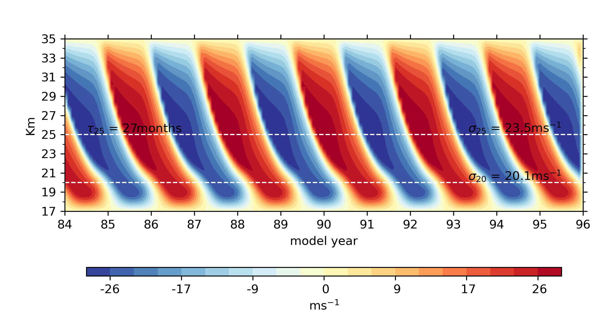

## Description
A PyTorch 1D QBO model.

The essential components of the code include:
- `adsolver.ADSolver`: a class for solving a forced advection-diffusion equation in one
 space dimension.
- `utils.load_model`: a utility for loading a Pytorch model, defined by a
 `ModelClass` and a `state_dict`, and containing the source term.

**Features**:
- Can be forced using a spectrum of waves.
- Can use backpropagation to optimize model parameters to a desired outcome.

<p align="right">(<a href="#top">back to top</a>)</p>


## "Installation"
The code requires (imports) PyTorch, NumPy, Matplotlib, and SciPy. To enjoy the
 example notebook you will also need Jupyter Notebook. A tested environment is
 provided in `qbo1d-environment-spec-file.txt` and can be replicated as follows:

```sh
conda create --name qbo1d --file qbo1d-environment-spec-file.txt
conda activate qbo1d
```

<p align="right">(<a href="#top">back to top</a>)</p>


## Documentation
Please refer to the [Documentation](https://datawaveproject.github.io/qbo1d/).


<p align="right">(<a href="#top">back to top</a>)</p>


## Working example
A working example is provided in the `example.ipynb` notebook. Here is a figure.
 The forcing in the figure consists of two waves of equal and opposite
 amplitudes &plusmn; 6 mPa, opposite phase speeds &plusmn; 32 m s<sup>-1</sup>,
 and equal wavenumbers 1. The vertical advection in this case equals
 10<sup>-5</sup> m s<sup>-1</sup>. Note, the figure shows the
 **last 12 years of a 96 year** long integration. The amplitudes and period
 estimates were estimated after 12 years of spinup.



<p align="right">(<a href="#top">back to top</a>)</p>

